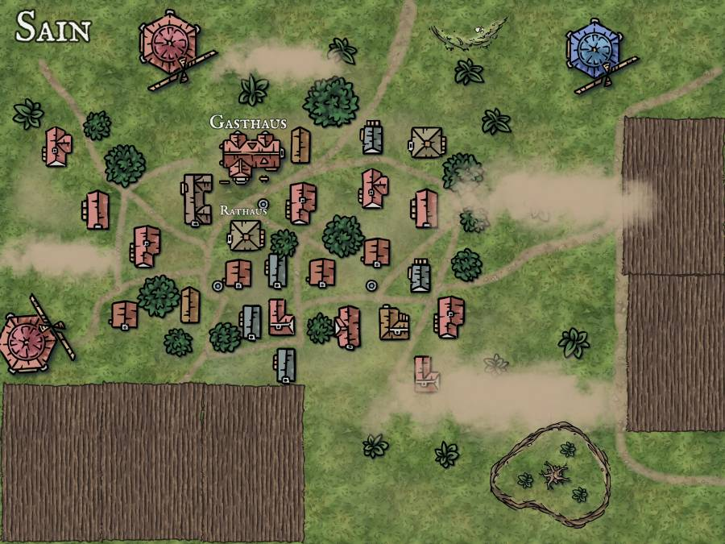

# Sain

Sain ist ein etwas größeres Menschendorf, dass sich in Sichtweite der ehemaligen Zwergen-Befestigung Trifels gegründet hat. Sain hat eigentlich nur eine Hauptaufgabe und zwar die Gewinnung aller Bier Bestandteile (Altmodisch: Wasser, Hopfen, Malz, Gerste). Diese werden in großen Mengen (Nahe zu alles) nach Trifels gebracht, da dort die [Platzhalter] Brauerei das lokale Bier braucht. Was übrig bleibt, kann der Bäcker noch in Brot verwandeln und an die Bevölkerung verkaufen. Manche halten auch Tiere, wie gesagt, ein Bauerndorf.

Es gibt eine Stadthalle, die aus einem Büro besteht wie einen größere überdachte Fläche, für Versammlung und Kundgebungen.

Eine Taverne darf natürlich auch nicht fehlen.

