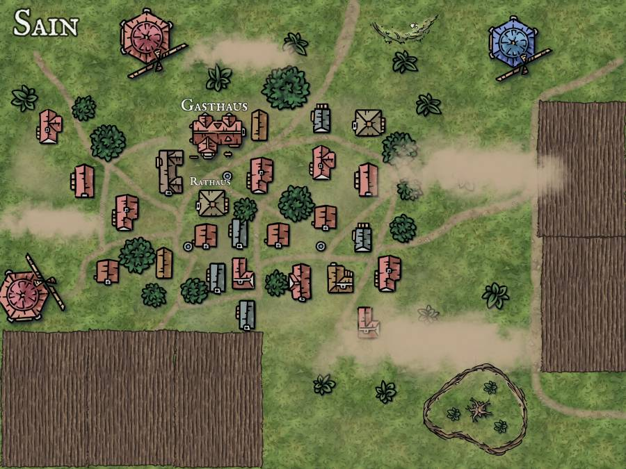

# Sain

Sain is a somewhat larger human village that was founded within sight of the former dwarf fortress of Trifels. Sain actually has only one main task and that is the extraction of all beer ingredients (old-fashioned: water, hops, malt, barley). These are brought to Trifels in large quantities (close to everything) because the [placeholder] brewery there needs the local beer. What is left over, the baker can still turn into bread and sell it to the population. Some also keep animals, as I said, a farming village.

There is a town hall, which consists of an office like a larger covered area, for meetings and rallies.

Of course, there is also a tavern.

