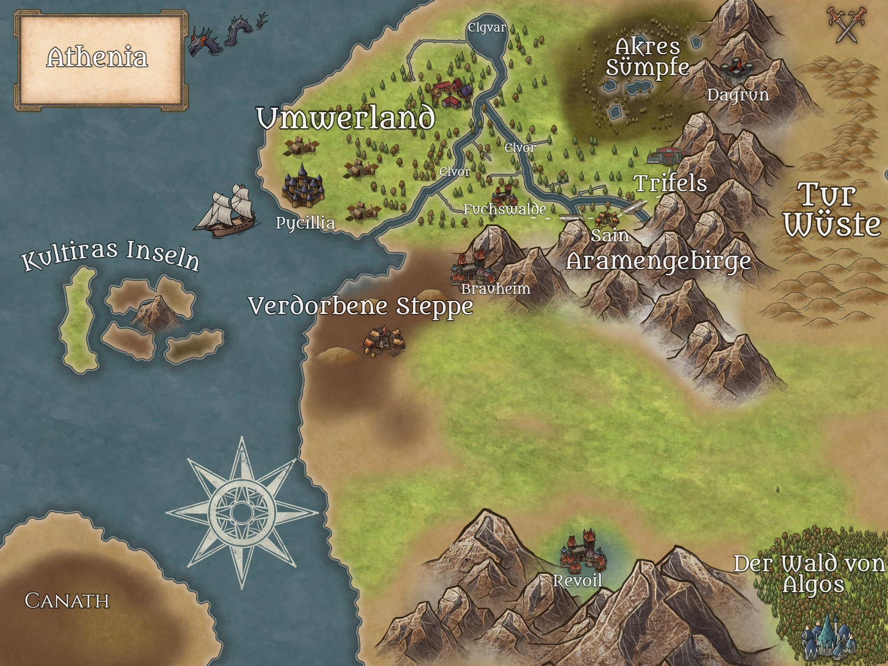

# Athenia

## Why the GitHub Repo?

I would like to make this world available to everyone for private use.

## The World

Athenia is another fantasy world created by me. I created the world on the basis of an impromptu round of pen and paper and developed it further. I would like to create a world that can be used by everyone.
The world should not be serious and standard, so there are some funny characters like places to look at. After the usual races of humans, dwarves, orcs, there are also bolgs, knuts and other creatures. You can explore the Umwerland, a friendly area, followed by the Kultiras Islands, which can be beautiful but also hard. The blighted steppe used to be beautiful and the Aramen Mountains are as high as ever. Further down follow the forests of the Algos where Revoil, a very unusual town, lies in a valley. The Tur Desert is a hard place for all but its inhabitants.

Quite a lot is known about the continent of Canath. But most have never been there.
